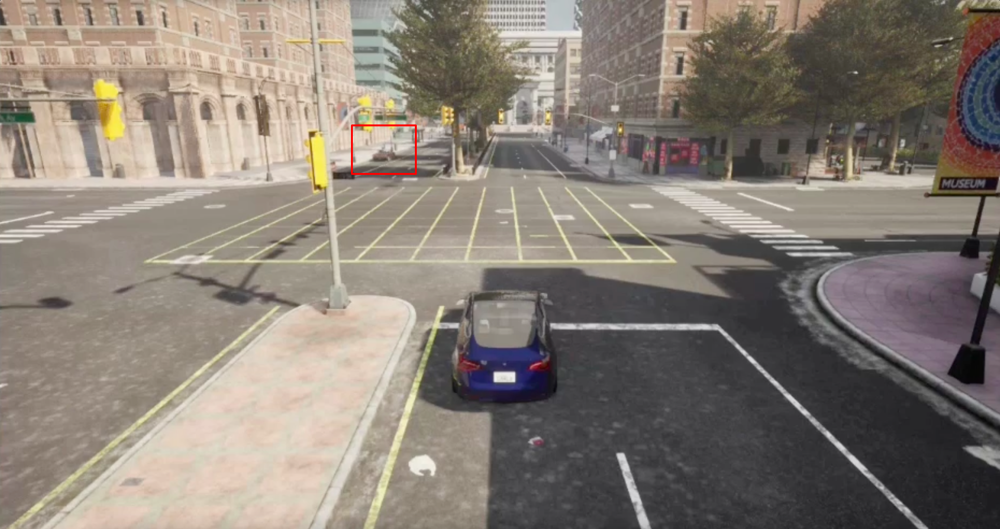
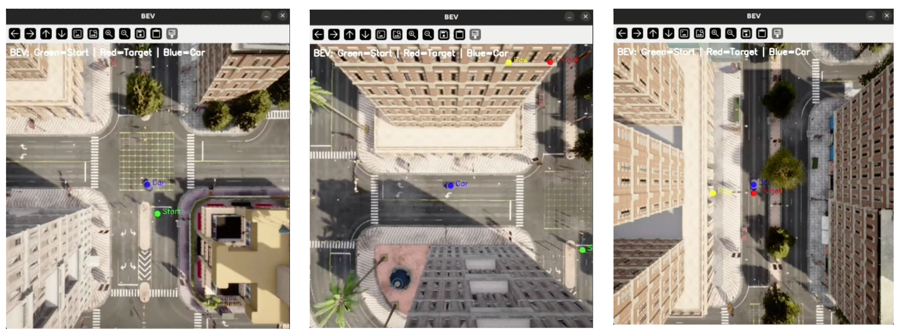
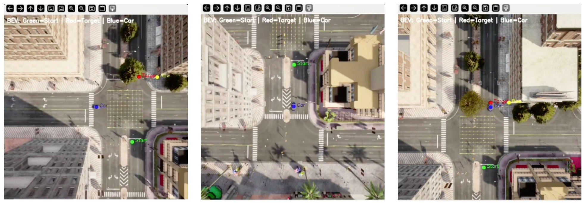

# Vision-Language Navigation in CARLA

This project demonstrates how a **Vision-Language Model (VLM)** can
guide a vehicle in the CARLA simulator using **natural language
commands**.\
The system overlays a grid on the front camera view, finds the object
mentioned in the command, converts its position to world coordinates,
and then drives the car to the location.

## Features

-   Autonomous vehicle spawned in CARLA

-   RGB + Depth cameras for perception

-   Bird's Eye View (BEV) camera for visualization

-   Grid overlay + object cell selection using **VLM**

-   Conversion from pixel → world coordinates

-   Automatic waypoint navigation using CARLA's `BasicAgent`

-   Natural language commands like:

    -   `navigate to the nearest streetlight`
    -   `go to the bin`
    -   `drive to the parked car`

## Results
### Example 1 — Go to a car (Success)

Initial view:

Navigation sequence:


### Example 2 — Go to a bus stop (Fail)
Initial view:

Navigation sequence:


## Requirements
### Software

-   Python 3.8+
-   CARLA Simulator (0.9.x)
-   CARLA Python API
-   OpenCV
-   NumPy
-   Pillow (PIL)
-   Ollama or cloud endpoint supporting a VLM\
    Example: `qwen3-vl:235b-cloud`

### Python Dependencies

Install:

``` bash
$ python3 -m venv venv
$ source venv/bin/activate
$ pip install -r requirements.txt
```

## Running the Program

Start CARLA:

``` bash
./CarlaUE4.sh
```

Run:

``` bash
python main.py
```

You will see a prompt:

    Simulation ready. Enter natural language navigation commands.

Example:

    Command: navigate to the bin

Exit:

    Command: quit

## File Structure

    project/
    │
    ├─ utils/
    │   └─ carla_controller.py
    │
    ├─ main.py
    ├─ output/
    │   └─ target_xxx.jpg
    └─ README.md

## Example Prompts

    go to the red car
    navigate to the traffic light
    head towards the bus stop
